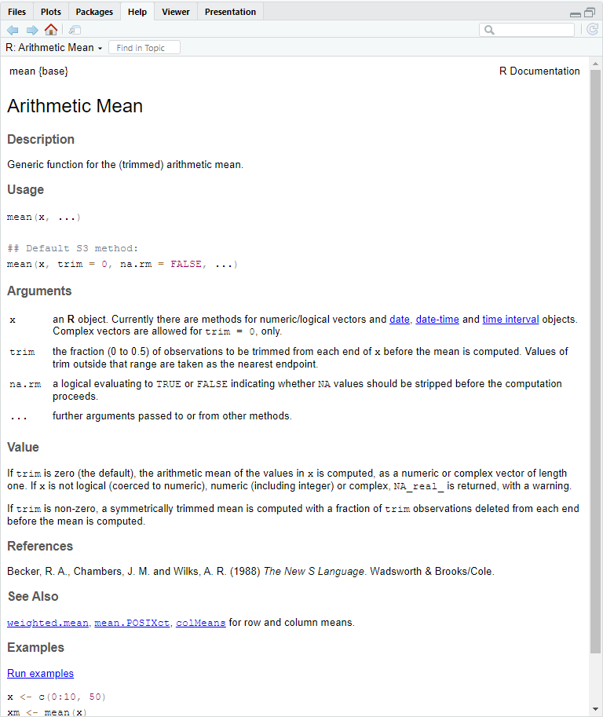
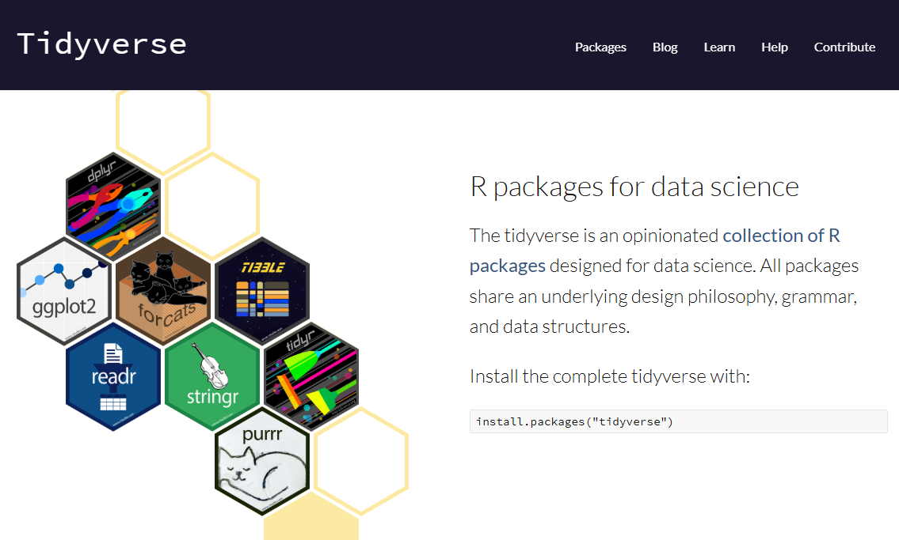

---


# **3. Exploring R Basics**

------------------------------------------------------------------------

## **3.1 Introduction to RStudio Interface**

RStudio is a powerful and user-friendly interface for working with R. It
simplifies coding and data analysis with its organized layout and handy
tools. Here’s a quick tour of the four main panels you’ll use:
**Console**, **Script Editor**, **Environment/History**,
**Plots/Packages/Help/Viewer**.

<br> 

<br>

---

### **3.1.1 Console (Bottom Left)**

-   **Purpose:** This is where you interact with R directly. You can
    type commands, press Enter, and see the results immediately.
-   **Key Features:**
    -   The Console only allows **line-by-line execution**. This means
        you can type a single command, run it, and see the output right
        away. For longer scripts or multiple lines of code, you’ll need
        the Script Editor.
    -   Previous commands can be accessed using the up arrow key, so you
        don’t have to retype them.
    -   Error messages and warnings are displayed here, helping you
        debug your code.
-   **Example:** Type `2 + 2` and press Enter. You’ll see:


``` r
2+2
```

```         
[1] 4
```

------------------------------------------------------------------------

### **3.1.2 Script Editor (Top Left)**

-   **Purpose:** A space for writing and saving longer pieces of code,
    called scripts.
-   **Key Features:**
    -   Write multiple lines of code.
    -   Save your script for future use (File \> Save as `.R` file).
    -   Run lines of code by selecting them and pressing `Ctrl + Enter`
        (Windows) or `Cmd + Enter` (Mac).
-   **Example:**
    -   Go to **File \> New File \> R Script** to open a new script
        file.
    -   Type the following code in the Script:


``` r
2 + 2
```

-   Highlight the line, then press `Ctrl + Enter` (Windows) or
    `Cmd + Enter` (Mac) to run it.
-   The result will appear in the Console:

```         
[1] 4
```

-   If you want to save your `2 + 2` work for future use, save the
    script using **File \> Save As**, which will save it as a `.R` file
    that you can reopen later.

------------------------------------------------------------------------

### **3.1.3 Environment/History (Top Right)**

-   **Environment Tab**:
    -   **Purpose:** Shows all the variables, datasets, and objects
        you’ve created.
    -   **Example**: If you create the following in the Console or
        Script Editor:


``` r
x <- 2 + 2
```

You’ll see `x` listed in the Environment tab with its value
`4`.

-   **History Tab**:
    -   Keeps a record of all commands you’ve run in the Console.
    -   You can click on any command in the history to re-run or copy
        it.

------------------------------------------------------------------------

### **3.1.4 Plots/Packages/Help/Viewer (Bottom Right)**

---

-   **Plots Tab**:
    -   **Purpose:** Displays graphs and visualizations generated by
        your code.
    -   **Example:** Create a simple plot:


``` r
plot(1:10)
```


The graph will appear in the Plots tab.

<br>
**Note**: If you are working in an **R Markdown** or **R
Notebook** instead of an **R Script**, the graph will appear directly in
the document output instead of the Plots tab.

---

-   **Packages Tab**:
    -   **Purpose:** Manage R packages (install, update, and load them).
    -   **Example:** Install and load the `ggplot2` package by running
        this code:


``` r
install.packages("ggplot2") #installing the package
library(ggplot2) #loading the package
```

You should see `ggplot2` appear in the Packages tab with a checkmark indicating that it is loaded.

---

**Question**: What's the purpose of `#` the above code?
<details> <summary>Click here for the answer</summary>
In R, the `#` symbol is used to **add comments** to your code. Comments are lines of text that **R ignores when running the code**. They’re incredibly useful for **explaining** what your code does or for **leaving notes to yourself or others who may read your script**.
</details>

---

-   **Help Tab**:
    -   **Purpose:** Access documentation and help files for R
        functions.
    -   **Importance:** The Help Tab is your go-to resource for
        understanding how R functions work. It provides detailed
        explanations, examples, and descriptions of arguments.
        -   You should always check the documentation when you're unsure
            about a function or need clarification on how to use it.\
        -   This habit will save you time and help you write more
            accurate and efficient code.
    -   **Example:** Search for help on the `mean` function by typing `?` in front of a function name:


``` r
?mean
```

<br> 

------------------------------------------------------------------------

-   **What to Look For in the Help Tab Output:**
    -   **Description**: A brief summary of what the function does
        (e.g., `mean` calculates the arithmetic mean).\
    -   **Usage**: Shows how to write the function and the required
        inputs (e.g., `mean(x, trim = 0, na.rm = FALSE)`).\
    -   **Arguments**: Describes each input:
        -   `x`: The data to compute the mean from.
        -   `trim`: The fraction of data to exclude from each end
            (default is `0` if not specified).
        -   `na.rm`: Whether to remove `NA` values before calculation
            (default is `FALSE` if not specified).
    -   **Default Arguments**: Defaults save you time by providing
        pre-set values for arguments. For example:
        -   If you don’t specify `trim`, it assumes `0`.
        -   If you don’t specify `na.rm`, it assumes `FALSE`. You only
            need to include these arguments if you want to override the
            defaults.
    -   **Value**: Explains the output of the function\
    -   **Examples**: Examples of code snippets to see the function in
        action
-   **Pro Tip:** Always check the **Arguments** section to understand
    the defaults, and look at the **Examples** section to see how the
    function is typically used.

------------------------------------------------------------------------

-   **Viewer Tab**:
    -   **Purpose:** View web-based outputs, such as interactive graphs
        or HTML reports.

------------------------------------------------------------------------

## **3.2 Start our initial exploration in R**

---

**Excercise**

**1. Find the square root of 1024 using R.** *Hint: Use the sqrt()
function*

**2. What happens when you run the following code?**


``` r
print("Hello, World!")
```

<details>
<summary>Click for Answer</summary>

```
[1] "Hello, World!"
```

</details>


**3. Consider the following code:**


``` r
x <- 42
x
x <- 43
x
```

*Question: What is the value of x after the last line?*

<details>
<summary>Click for Answer</summary>

```
[1] 43
```

</details>


**4. Consider the following code:**


``` r
y <- 10
z <- x + y
z
```

*Question: What is the value of z?*

*Challenge: Change the value of y to 20 and recalculate z. What happens
to z?*

<details>
<summary>Click for Answer</summary>

```
[1] 53
```

The value of z will be `63` after changing the value of y to `20`.

</details>

**5. What happens if you try assigning a value to a variable using `=` instead of `<-`?**


``` r
x = 10
x
```


<details>
<summary>Click for Answer</summary>


In R, both `=` and `<-` can be used for variable assignment. However, `<-` is **preferred in R** because:

-   It’s the standard syntax used in most R code, making it easier to
    read and consistent across scripts.
-   It avoids confusion with `=` used in function arguments.

**Example:**


``` r
# Using `=` for variable assignment:
x = 10  
print(x)
```

```
## [1] 10
```

``` r
# Using `=` inside a function argument:
mean(x = c(1, 2, 3))  # `x` is a parameter that we will pass a value (known as an argument) to to the mean function. X here is not a variable.
```

```
## [1] 2
```

*What's the difference between what we did to x here?*


``` r
# Preferred approach to avoid confusion:
x <- 10  # Assign 10 to variable x
print(x)
```

```
## [1] 10
```

``` r
mean(x = c(1, 2, 3))  # Use x as input for the mean function
```

```
## [1] 2
```

We will learn more about the distinction later once we cover the concepts of variables and functions.
</details>

------------------------------------------------------------------------

## **3.3 Variables and Variable Assignment**

**What is a variable?**

- A variable in R is a container that stores a value (e.g., a number, text, or dataset) for future use.
- Think of it as a labeled box where you can put things and retrieve them later.

---

**How to assign a value to a variable**

In R, you assign a value to a variable using `<-` (preferred).

**Examples:**


``` r
# Assigning values using `<-`
x <- 10
y <- "Hello, R"
```

Now you can retrieve the stored values later.


``` r
# Assigning values using `<-`
print(x)
```

```
## [1] 10
```

``` r
print(y)
```

```
## [1] "Hello, R"
```

**Variable naming Rules**

- **Can contain**: Letters, numbers, underscores (_), and dots (.).
- **Must start with**: A letter or a dot (not followed by a number).
- **Cannot contain**: Spaces or special characters (@, #, etc.).
- **Case-sensitive**: myVar and MyVar are different variables.

**Quiz: Is it a valid variable name in R?**

For each example below, determine whether it’s a valid variable name in R. Write down **Yes** or **No** for each.

1. `my_var`  
2. `2cool`  
3. `.hiddenValue`  
4. `total.sales`  
5. `hello world`  
6. `data#123`  
7. `_underscore`  
8. `abc_123`  
9. `.1startingWithDot`  
10. `CaseSensitive` vs `casesensitive`  

---

<details>
<summary>Click here for the answers</summary>

**Key: valid variable names**

1. `my_var` → **Yes**  
2. `2cool` → **No** (Starts with a number)  
3. `.hiddenValue` → **Yes**  
4. `total.sales` → **Yes**  
5. `hello world` → **No** (Contains a space)  
6. `data#123` → **No** (Contains a special character `#`)  
7. `_underscore` → **No** (Cannot start with an underscore)  
8. `abc_123` → **Yes**  
9. `.1startingWithDot` → **No** (Dot followed by a number)  
10. `CaseSensitive` vs `casesensitive` → **Both are valid but different variables** (Case-sensitive).  

</details>

---

**Exercise**

Copy and paste the following code into your R Script, run it, and answer the questions.


``` r
# Assign values to variables
a <- 50
b <- 100

# Perform operations with variables
c <- a + b
c

# Modify a variable
a <- a * 2
a
```

**Questions**:

- What is the value of `c`?
- What happens to `a` after you modify it?
- Can you create a variable named 1a? Why or why not?

---

**Pro Tip: Use descriptive variable names**

Choose meaningful names for variables to make your code easier to understand.


``` r
total_sales <- 1000  # Clear and descriptive
x <- 1000            # Ambiguous
```

---

## **3.3 Functions in R**

---

**What's a function?**

A **function** in R is a block of code that performs a specific task. Functions help you reuse code and simplify your work by performing complex operations with just a single line.

---

**Why use functions?**

- **Efficiency**: Avoid rewriting code for repetitive tasks.
- **Clarity**: Make your code easier to read and understand.
- **Modularity**: Break your work into smaller, reusable pieces.

---

**How functions work**

Functions take inputs (called **arguments**) and return outputs. These inputs are specified in the function as **parameters**, which act as placeholders for the values you provide. When calling a function, you match **parameters** to **arguments**.

---

**Structure of a function**


``` r
function_name(parameter = argument)
```

---

**Examples of built-in functions that come with base R**

- *Math functions*


``` r
sqrt(16)       # Square root of 16
```

```
## [1] 4
```

``` r
log(100, 10)   # Logarithm base 10 of 100
```

```
## [1] 2
```

- *Statistical functions*


``` r
mean(c(1, 2, 3, 4, 5))  # Average of numbers
```

```
## [1] 3
```

``` r
sum(1:10)               # Sum of numbers 1 to 10
```

```
## [1] 55
```

- *String functions*


``` r
tolower("HELLO")  # Convert to lowercase
```

```
## [1] "hello"
```

``` r
toupper("hello")  # Convert to uppercase
```

```
## [1] "HELLO"
```

---

**Creating your own function**

You can define your own function in R using the function keyword. ***NOTE THE SPECIFIC CODE STRUCTURE***

*Structure of a function creation*

``` r
function_name <- function(x, y, ...) {
  Steps of things you want to do with the inputs x, y, ...
}
```

*Example*


``` r
# Define a function to calculate the square of a number
square <- function(x) {
  return(x^2)
}
```

In the above code, we create a function called `square()`, which takes an **argument** assigned to a **parameter** `x`. When the function is called, the action specified in `{}` is performed using the provided argument. 

*Calling the function*

``` r
# Use the function
square(5)  # Output: 25
```

```
## [1] 25
```

Here:

- `5` is the argument passed to `x` when the function is called.
- The result of `x^2` is returned as the output.

---

## **3.4 Packages: Extending the Power of R**

---

**What is a package?**

Normally, for beginners, we don’t frequently have to write our own functions. Instead, we can use functions that others have already created and shared through packages, saving our time and effort.

A **package** is a collection of R functions, datasets, and documentation bundled together for a specific purpose. Think of it as an “add-on” that provides tools tailored to your needs.

---

**Why use packages?**

- Packages let you use functions that aren’t built into base R.  
- They save time by providing pre-written code for common tasks.  
- They’re widely used for tasks like plotting (`ggplot2`), data manipulation (`dplyr`), or bioinformatics (`Bioconductor` packages).

---

**Installing and loading packages**

1. **Install a package**

   - Use the `install.packages()` function to download and install a package.
   - **Note**: Package names go inside quotes (`""`) when using `install.packages()`.
   - Not all packages can be installed this way and may require alternative installation methods. Check the documentation for that specific package if you encounter issues during installation by simply google it.
   - Example:
     

``` r
install.packages("dplyr")  # Install a package called dplyr. Note the quotation.
```
   
   
2. **Load a package**

   - Use the `library()` function to load a package into your R session. This is like open the software you'd like to use here.
   - **Note**: Package names do NOT need quotes when using `library()`.
   - Example:
     

``` r
library(dplyr)  # Load the package dplyr. No quotation here.
```

3. **Check Installed Packages**

   - See all installed packages in the **Packages Tab** (Bottom Right of RStudio).  
   - Use `installed.packages()` in the console to list them:


``` r
installed.packages()
```
---

**Starting with `library()` in R Scripts**

Typically, when you see an R Script shared by others, it will start with a section that loads all the necessary packages using `library()`. This ensures that all the tools needed for the script are available.

- **Why?** If you’d like to replicate the script, you can simply copy and paste it, and everything should work as long as the required packages are installed.  
- **What if it doesn’t?** If you encounter an error, it usually means the package isn’t installed. You just need to install it, often using `install.packages("package_name")`, and you’re good to go.  
- **Reminder:** You only need to install a package once, but you must load it with `library()` every session.

*Example*


``` r
# This is the beginning of a script. We will load required packages.
library(ggplot2)  # For advanced plotting
library(dplyr)    # For data manipulation
library(tidyr)    # For tidying data
library(readr)    # For reading CSV files

#Now we can start getting our hands dirty!
```

Note that the above packages are parts of tidyverse. You can simply install and load the tidyverse package instead.




*Example*

``` r
library(tidyverse)
```

---

## **3.5 Setting up Working Directory**

---

**The challenges of command-line interfaces**

When working with R, you’ll notice a big shift compared to how we usually interact with computers. In R programming, you’ll primarily use **typed commands** to perform actions, unlike the **clicking and dragging** you’re used to in **Graphical User Interface (GUI)**. This text-based interactive approach is known as a **Command-Line Interface (CLI)**.

Imagine you’re writing a document in MS Word. You don’t need to think much about where your file is saved—you just click “Insert” to add an image from a gallery of icons and save the document wherever you like, often with just a few clicks. Later, you can simply drag and drop files around your desktop to organize them.

In CLIs, things are more structured but less forgiving. You must be aware of **where you are working** because when you save a file, it’s saved in your **current working directory**. If you don’t specify where to save or open files, R assumes it should look in or save to this directory. If you aren’t mindful of this, errors like `File not found` or misplaced outputs can occur.

<br>


<br>

---

**What's a directory?**

For a beginner, you can assume a **directory** as simply a folder on your computer that holds files and subfolders. Directories help you organize your work and locate files easily. In R, directories are critical because they determine where your input files (like datasets) are read from and where output files (like results or plots) are saved.

What’s different from what you’re used to is that, instead of navigating through your screen by clicking and dragging folder icons to access files, you’ll now access files by specifying ***a path*** through **typing**.

For example, on Windows, if you want to access a file called `homework1.docx` in the `Documents` folder, you would specify its path as `C:/Users/YourName/Documents/homework1.docx`.

---

**Types of directories**

When working in R, directories play a crucial role in managing your files. Understanding the difference between **Home Directory** and **Working Directory** will help you avoid common pitfalls when reading or saving files.

### **1. Home Directory**:  

   - The starting point or default location on your computer.  
   - Example: `C:/Users/YourName/Documents` (Windows) or `/Users/YourName` (Mac).  
   - The home directory is often used as a reference point and can be accessed in R using the shortcut `~`, so you don’t need to type the whole path.  
   - **Example**: If your home directory is `C:/Users/YourName/Documents` (default for R on Windows), and you want to access a file called `homework1.docx`, instead of typing:


``` r
"C:/Users/YourName/Documents/homework1.docx"
```

You can simply type:


``` r
"~/homework1.docx"
```

This makes navigating files faster and avoids lengthy path names.

**Pro Tip**: If you’re used to using `~` as a shortcut for switching languages (e.g., keyboard input), this might give you a headache when working in a Command-Line Interface (CLI). In R, `~` has a specific meaning as the home directory path.

### **2. Working Directory**:

   - The folder R is currently using to read or save files.  
   - Think of it as the "active folder" for your current R session.  
   - You can change the working directory as needed to organize files for a specific project. If not, your home directory will be your working directory.  
   - Example:  


``` r
setwd("~/Projects/MyAnalysis")
```
   - It’s good practice to set up a unique working directory for each project to keep input files and outputs well-organized.

---

**Setting up a working directory in R**

**1. Check Your Current Directory**:  
   
Use the `getwd()` function (**"get working directory"**) to check your current working directory:  
   

``` r
getwd()
```

**2. Set a New Working Directory**:

Use the setwd() function (**"set working directory"**) to change the working directory to another specific folder you already have:


``` r
setwd("~/MyProject")
```

You can check if the working directory has change by running `getwd()` again.


``` r
getwd()
```

---

**Exercise**: 

**Create a folder called `SCSI180_Project` in your `Documents`. Then, make the folder `SCSI180_Project` your working directory.**

---

## **3.6 Types of Variables**

---

Now let’s go back to variables. As we learned previously, variables are containers for storing values. These values can take different forms, depending on the type of data being stored. Understanding these **variable types** is crucial because it determines how you can manipulate and use the data in calculations or functions.

<br>

**Common Variable Types in R**

**1. Numeric: integer, double**

**2. Character**

**3. Logical**

**4. Factor**

<br>

You can use these functions to check the type of a variable:

- **`class()`**: Tells you the type of the variable.
- **`typeof()`**: Provides a more technical description of the data type.

---

### **1. Numeric**:  

   R stores numeric data as either **integers** or **doubles**.  
   
   - **Integer**: Whole numbers without decimals.  


``` r
x <- 10L  
typeof(x) 
```

```
## [1] "integer"
```
*Appending an uppercase `L` to a numeric value is a way to explicitly make it an integer. Otherwise, it will be a double by default.*
   
   - **Double**: Floating-point numbers (numbers with decimals). By default, R treats all numeric data as doubles unless specified as integers with appending `L`.  
     

``` r
y <- 3.14
typeof(y)
```

```
## [1] "double"
```

**Note**: Unlike some programming languages, R does not have a separate "float" type.

---

### **2. Character**:  

   - Represents text, often referred to as **strings**, which are sequences of characters enclosed in quotes.  


``` r
name <- "Alice"
greeting <- "Hello, World!"
     
print(name)
```

```
## [1] "Alice"
```

``` r
print(greeting)
```

```
## [1] "Hello, World!"
```

``` r
typeof(name)
```

```
## [1] "character"
```

**Pro Tip**: Strings can use either single (`'`) or double (`"`) quotes, but they must match.

---

### **3. Logical**:  
   
   - Represents `TRUE` or `FALSE` values, often used in conditions or comparisons.
   - Generally equivalent to what is commonly known as a **boolean** in other programming languages.
     

``` r
is_valid <- TRUE
is_greater <- 5 > 3

print(is_valid)
```

```
## [1] TRUE
```

``` r
print(is_greater)
```

```
## [1] TRUE
```

``` r
typeof(is_greater)
```

```
## [1] "logical"
```

---

**Quiz**:

**3.1 Run the following code:**


``` r
a <- 5 == 8

typeof(a)
```
   
- What is the output of `typeof(a)`?
- What does `5 == 8` evaluate to?

**3.2 What is the difference between `=` and `==` in R?**

<details> <summary>Click here for the answers</summary>

**3.1 Output of** `typeof(a)`:

The output is `"logical"`.

Explanation: The comparison `5 == 8` evaluates to `FALSE` because 5 is not equal to 8. The variable `a` is assigned this logical value, and `typeof(a)` confirms its type as logical.

**3.2 Difference Between `=` and `==`**:

- `=` is used for **variable assignment**, similar to `<-`, though it's **not the preferred** method in R

Example:


``` r
x = 10  # Assigns 10 to x (not preferred)
x <- 10 # Assigns 10 to x (preferred)
```

- `=` is also used to **specify arguments to parameters in functions**.

Example:


``` r
mean(x = c(1, 2, 3))  # Assigns the vector c(1, 2, 3) to the parameter x
```

```
## [1] 2
```

- `==` is used for **comparison**. It checks if two values are equal and returns a logical result (`TRUE` or `FALSE`).

Example:


``` r
5 == 8  # Returns FALSE
```

```
## [1] FALSE
```

**Key Takeaway**:

- Use `==` for comparisons
- Use `<-` (preferred) or `=` for variable assignments
- Use `=` when specifying arguments in function calls to avoid confusion

</details>
---

### **4. Factor**:  
   
   - Represents **categorical/discrete data** with fixed levels, like a dropdown list with pre-defined options.  
     

``` r
gender <- factor(c("Male", "Female", "Male"))
gender
```

```
## [1] Male   Female Male  
## Levels: Female Male
```

**Why use factors?** They ensure consistency in categorical data and are more memory efficient.

---

## **3.7 Data Structure in R**

Now that we’ve covered variable types, let’s explore how data is organized and stored in R. R provides various **data structures** to handle collections of data. The three most commonly used are: 

<br>
**1. Vectors**

**2. Dataframes**

**3. Lists**

---

### **1. Vector**

- A **vector** is a simple, one-dimensional collection of data, where all elements **must be of the same type** (e.g., numeric, character, logical).
- Think of it as a column of values in a spreadsheet.
- The `c()` function (short for "combine") is used to create vectors in R by combining individual values into a single structure.

**Example**:


``` r
# Numeric vector
num_vec <- c(1, 2, 3, 4, 5)

# Character vector
char_vec <- c("Apple", "Banana", "Cherry")

# Logical vector
log_vec <- c(TRUE, FALSE, TRUE)
```

**Question**:

*What happen if you try to do this?*


``` r
mixed_vec <- c(1, "Apple", TRUE)
```

<details> <summary>Click here for the Answer</summary>
When you use `c()` to combine values of different types, R will automatically **coerce them to the same type**. In this case:

`1` (numeric) and `TRUE` (logical) will be converted to **character** to match `"Apple"`.

Result:


``` r
print(mixed_vec)
```

```
## [1] "1"     "Apple" "TRUE"
```

Note that `1` and `TRUE` are now `"1"` and `"TRUE":` as strings/character.

</details> 

---

### **2. Dataframe**

A **dataframe** is a two-dimensional structure, like a table, where data is organized into rows and columns. Each **column** can store data of a single type (e.g., numeric, character, or logical), but **different columns** can store different types of data.

Think of it as an Excel spreadsheet:

- Each **column** is like a variable that **holds data of the same type**.
- Each **row** is like an observation, representing one entry in the dataset.

You also can think of a dataframe as **a collection of vectors combined as columns**:

- Each column is a vector.
- You combine multiple vectors (of the same length) to create a dataframe.

<br>


<br>
**Example**:


``` r
df <- data.frame(
  Name = c("Alice", "Bob", "Charlie"),  # Character vector
  Age = c(25, 30, 35),                 # Numeric vector
  Passed = c(TRUE, FALSE, TRUE)        # Logical vector
)
```


``` r
print(df)
```

```
##      Name Age Passed
## 1   Alice  25   TRUE
## 2     Bob  30  FALSE
## 3 Charlie  35   TRUE
```

You can extract a column (which is essentially a vector) from a dataframe using the `$` operator as `dataframe_name$column_name`


``` r
print(df$Name)
```

```
## [1] "Alice"   "Bob"     "Charlie"
```

``` r
typeof(df$Name) #This should be a character vector
```

```
## [1] "character"
```

---

### **3. List**

A list is a flexible data structure that can store a collection of elements of different types, including vectors, data frames, and even other lists.
Think of it as a box where each item can be completely different.


``` r
# Create a list
my_list <- list(
  Name = "Alice",
  Scores = c(90, 85, 88),
  Details = data.frame(Subject = c("Math", "Science"), Grade = c("A", "B"))
)
```


``` r
print(my_list)
```

```
## $Name
## [1] "Alice"
## 
## $Scores
## [1] 90 85 88
## 
## $Details
##   Subject Grade
## 1    Math     A
## 2 Science     B
```
---

## **3.7 Understanding Dataframes**

Remember our previous discussion on the power of tabular data? Dataframes in R are a highly organized way to handle tabular data, following specific rules for structure and consistency. 

Let’s break down their design and focus on how rows and columns are arranged and utilized.

---

### **Understanding dataframes: Rows vs. Columns**

Imagine you’re conducting a survey where each person fills out a form with information like their age, gender, occupation, and favorite color. Here’s how the data would look in a dataframe:

**Rows**: 

Each row represents one individual.

- Diana fills out the first row.
- David fills out the second row.
- And so on, with each row capturing data entry about one person.

**Example**:

| Name  | Age | Gender | Occupation | Favorite Color |
|-------|-----|--------|------------|----------------|
| Diana | 25  | Female | Engineer   | Blue           |
| David | 30  | Male   | Teacher    | Green          |

---

### **Rows: the Individualist View on All Characteristics**

When you look at a single row, you’re seeing data about one individual. It’s like learning about a single person’s characteristics.

**For example**:

- **Row #1**: Diana, 25, Female, Engineer, Blue. ***This is all about one person, Diana, with her all characteristics.***  
- **Row #2**: David, 30, Male, Teacher, Green. ***Similarly, this is all about David.***  

This is an **individualist view**, but in data science, we’re rarely interested in just one person’s data. Instead, we look for patterns across the group.

---

### **Columns: the Collective View of Each Characteristic**

In data science, the focus is typically on **columns** of a dataframe because:

- A column represents one characteristic (also known as **variable** or **feature**) across the entire group.
- Columns help us identify patterns and relationships.

**Example**:  

The `Favorite Color` column tells us the preferred colors of all surveyed people. By focusing on this column, you can answer questions like:

- "What is the most common favorite color?"
- "How does favorite color relate to occupation?"

This **column-centric thinking** is at the heart of data analysis, allowing us to uncover trends and connections in the data.

---

### **Takeaway**

Columns are the backbone of how we think about dataframes in analysis. They help us uncover patterns and relationships within the data, providing insights into the group as a whole. Start with the columns, and let the data tell you the story of the group!

---

### **Exercise: Working with Dataframes**

Let’s practice creating and manipulating dataframes in R. **Try to complete these tasks on your own first**. Refer to the examples from the previous section if you need help.

---

**Exercise**

**1. Create a dataframe named `survey.1` using the following data**:

| Name  | Age | Gender | Occupation | Favorite Color |
|-------|-----|--------|------------|----------------|
| Diana | 25  | Female | Engineer   | Blue           |
| David | 30  | Male   | Teacher    | Green          |

   - Create individual vectors for each column.
   - Combine these vectors into a dataframe named `survey.1`.

**2. Extract the `Occupation` column from `survey.1` and assign it to a new variable called `job`**.

**3. Add a new column to `survey.1` for `Country` with the values `"USA"` and `"Canada"`**.

---

<details> <summary>Click here for the answers (only after trying the tasks yourself!)</summary>

**Answers**

**1. Create a dataframe**:
   

``` r
# Create vectors
Name <- c("Diana", "David")
Age <- c(25, 30)
Gender <- c("Female", "Male")
Occupation <- c("Engineer", "Teacher")
Favorite_Color <- c("Blue", "Green")

# Combine vectors into a dataframe
survey.1 <- data.frame(Name, Age, Gender, Occupation, Favorite_Color)

# View the dataframe
survey.1
```

```
##    Name Age Gender Occupation Favorite_Color
## 1 Diana  25 Female   Engineer           Blue
## 2 David  30   Male    Teacher          Green
```

**2. Extract the occupation column**:


``` r
# Extract the Occupation column
job <- survey.1$Occupation

# View the result
job
```

```
## [1] "Engineer" "Teacher"
```

**3. Add a new column**:


``` r
# Add a new column
survey.1$Country <- c("USA", "Canada")

# View the updated dataframe
survey.1
```

```
##    Name Age Gender Occupation Favorite_Color Country
## 1 Diana  25 Female   Engineer           Blue     USA
## 2 David  30   Male    Teacher          Green  Canada
```

</details>

---

### **Important Note on Dataframes**

When working with dataframes, it’s essential to understand the terminology commonly used in data science:

- An **individual** or **row** is often referred to as an **observation**. Each observation represents one entry in your dataset, such as a person or an event.
- A **column** or **characteristic** is typically called a **variable** or **feature**. Each variable represents a specific attribute that is measured or recorded across all observations.

---

### **Avoiding Confusion: Variables in Dataframes vs. Variables in Basic R**

In data science, the term **"variable"** within a dataframe context refers to a **column** of data (e.g., age, gender, income). However, in basic R programming, a **"variable"** refers to a named object that stores a value or data structure (e.g., `x <- 10`).

**Example**:

- In a dataframe, the column `Age` is called a **variable** because it represents a characteristic across all observations.
- In basic R, when you assign `Age <- c(25, 30)`, `Age` is a **variable** in the programming context that stores a vector.

**Key Takeaway**:

- When working with dataframes, think of **variables** as **columns** that represent characteristics or features.
- In R programming generally, think of **variables** as containers that hold data.
- **Keep this distinction in mind to avoid confusion as you work with data!** 

---

[Previous: 2. Installation of Base R and RStudio](installation-of-base-r-and-rstudio.html) | [Table of Contents](index.html) | [Next: 4. Glossary](glossary.html) 
